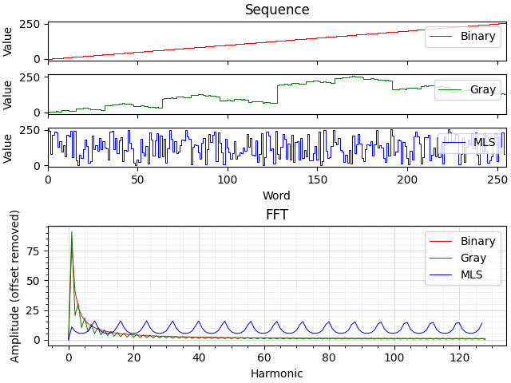
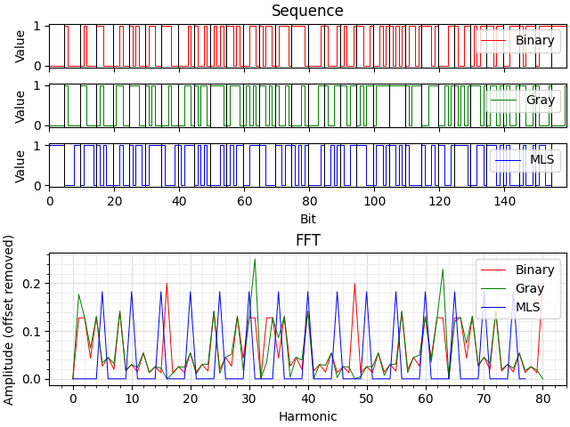

# Binary sequences

## Description

The purpose of this project is to:
1. Show the waveform and FFT of [binary](https://en.wikipedia.org/wiki/Binary_number), [Gray](https://en.wikipedia.org/wiki/Gray_code) and [MLS](https://en.wikipedia.org/wiki/Maximum_length_sequence) sequences.
2. Help to understand why an [absolute encoder](https://en.wikipedia.org/wiki/Rotary_encoder) uses an [MLS track](https://williamsprecher.com/pseudo-random-code-disc).
3. Demonstrate that an MLS is a type of [pseudorandom sequence](https://en.wikipedia.org/wiki/Pseudorandom_binary_sequence).

## Examples

### Changing the word length

```Bash
app.py --word-len 8
```



### Using sequences of bits instead of words

```Bash
app.py --word-len 5 --gen-bits
```


